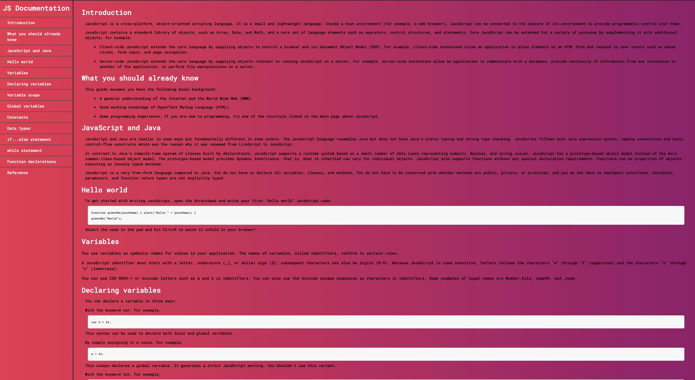

# ConquerFreeCodeCamp
Objective : Complete Freecode Full Stack Curriculum
Log for my FreeCodeCamp learning progress

## 1 . Responsive Web Designing Certification

# Projects
### 1. Tribute page for PaulWalker [responsive]

-----------

### 2. Blog feedback Form [accessiblity]

-----------

### 3. Blog Landing Page [responsive + mobile]

-----------

### 4. Technical Documnetation Page.[responsive + mobile]

-----------
